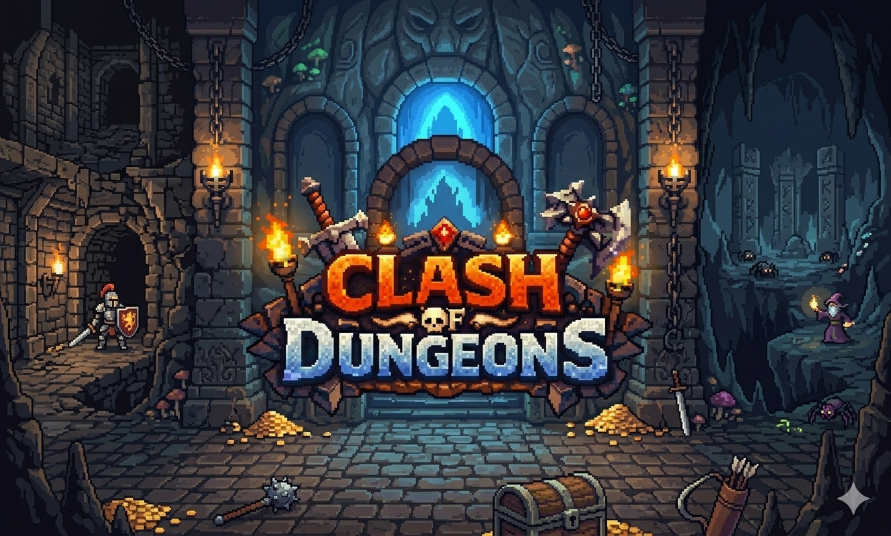

# Clash of Dungeons
## 🕯 About The Game

Clash of Dungeons is a dark 2D platformer set deep within gloomy underground labyrinths filled with deadly traps, challenging parkour, and dangerous enemies. Explore mysterious dungeons, collect all 3 hidden keys, and survive long enough to unlock the dungeon gate and escape to the next challenge. Every level tests your precision, timing, and courage in a world where danger lurks around every corner.

  

## 🧑‍🔬 About the developers
The developers of "Clash of Dungeons" are a dedicated team of passionate creators currently studying at Kaunas University of Technology. Our development process follows Agile principles, allowing us to iteratively improve and refine our game with each development cycle.

We are united by the same goal of making Clash of Dungeons a challenging but enjoyable experience for everybody. Each team member played a significant role in shaping the final product. Together we implemented a wide range of features, with each developer focusing primarily on:

- **Žygimantas Mikaila:** User interface and level selection system  
- **Martynas Pocius:** Health system and enemy mechanics  
- **Renaldas Popovas:** Main boss design and player movement  
- **Haroldas Montvila:** Combat system and project management  
- **Enrikas Lekešys:** Level design  

Through collaboration, creativity, and continuous iteration, we bring Clash of Dungeons for everyone to enjoy.
## ✨ Features

- ⚔ Challenging enemies
- 🗝 Hidden collectible keys
- 🕳 Deadly dungeon traps
- 🏃 Precision parkour
- 🌑 Dark atmospheric visuals
- 🚪 Multiple dungeon levels

## 🕹 Controls

  

## 🚀 Installation
1. Download archive from "Releases" section.
2. Unpack the archive.
3. Run "ClashOfDungeons.exe" file.

